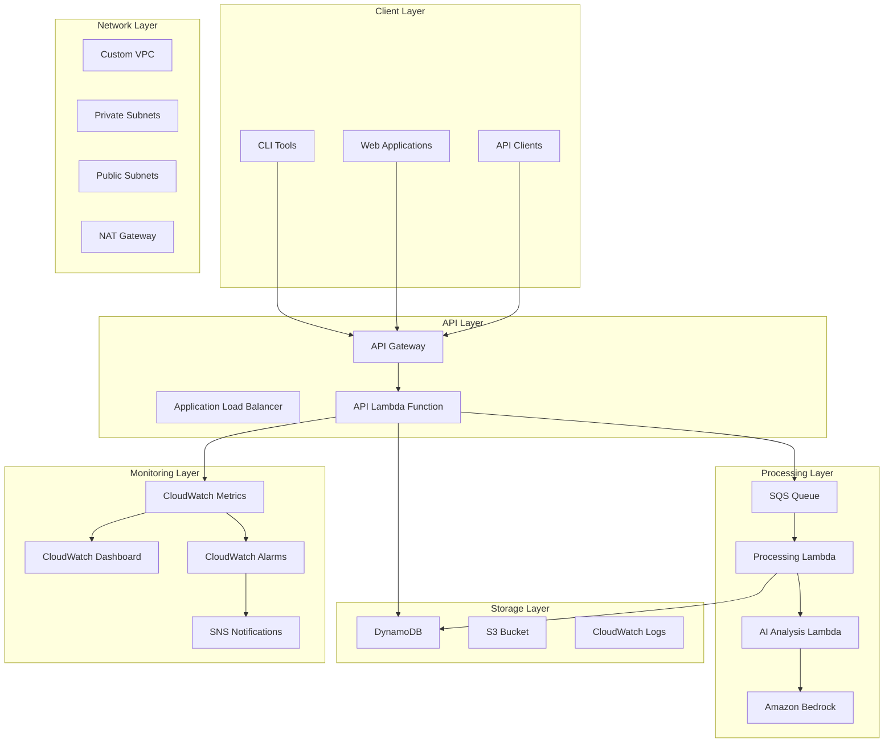

# 🚀 Resilient Monitoring Infrastructure with CI/CD - Complete Training Tutorial

   

## 📚 Table of Contents

1. [Learning Objectives](#-learning-objectives)
2. [Architecture Overview](#-architecture-overview)
3. [Core Components Deep Dive](#-core-components-deep-dive)
4. [Hands-On Tutorial](#-hands-on-tutorial)
5. [Advanced Features](#-advanced-features)
6. [CI/CD Pipeline](#-cicd-pipeline)
7. [Monitoring & Observability](#-monitoring--observability)
8. [Troubleshooting Guide](#-troubleshooting-guide)
9. [Best Practices](#-best-practices)
10. [Production Considerations](#-production-considerations)

## 🎯 Learning Objectives

By completing this tutorial, you will learn:

- ✅ **Cloud-Native Architecture**: Design resilient, scalable monitoring systems
- ✅ **Infrastructure as Code**: Use AWS CDK with TypeScript
- ✅ **Circuit Breaker Pattern**: Implement fault tolerance and resilience
- ✅ **Serverless Computing**: Build with Lambda, API Gateway, and DynamoDB
- ✅ **CI/CD Best Practices**: Automated testing, deployment, and monitoring
- ✅ **Observability**: Metrics, logging, alerting, and dashboards
- ✅ **AI-Powered Operations**: Amazon Bedrock for intelligent incident response
- ✅ **Event-Driven Architecture**: SQS, EventBridge, and asynchronous processing

## 🏗️ Architecture Overview



### 🔍 Key Architectural Patterns

1. **Circuit Breaker Pattern**: Prevents cascade failures
2. **Event-Driven Architecture**: Asynchronous processing with SQS
3. **Microservices**: Loosely coupled Lambda functions
4. **Infrastructure as Code**: Complete automation with CDK
5. **Observability First**: Built-in monitoring and alerting

## 🔧 Core Components Deep Dive

### 1. API Gateway + Lambda (Entry Point)

**Purpose**: Provides a resilient HTTP API for metric ingestion and querying.

**Key Features**:
- Rate limiting (1000 requests/second)
- Request/response caching
- CORS enabled for web applications
- Circuit breaker protection
- Comprehensive error handling

**Endpoints**:
```bash
# Health Check
GET /health
Response: {"status": "healthy", "circuit_breaker": "CLOSED", "services": {...}}

# Submit Metrics
POST /metrics
Body: {"service_name": "my-service", "metric_type": "response_time", "value": 150.5}

# Query Metrics
GET /metrics?service=my-service&limit=100
Response: {"metrics": [...], "count": 25, "scanned_count": 100}
```

### 2. Circuit Breaker Implementation

**Core Logic**:
```python
circuit_breaker = {
    'state': 'CLOSED',        # CLOSED, OPEN, HALF_OPEN
    'failures': 0,            # Current failure count
    'failure_threshold': 5,   # Max failures before opening
    'timeout': 60,            # Seconds before retry
    'last_failure_time': None
}

def is_circuit_breaker_closed():
    if circuit_breaker['state'] == 'CLOSED':
        return True
    elif circuit_breaker['state'] == 'HALF_OPEN':
        return True
    elif circuit_breaker['state'] == 'OPEN':
        if time.time() - circuit_breaker['last_failure_time'] > circuit_breaker['timeout']:
            circuit_breaker['state'] = 'HALF_OPEN'
            return True
        return False
```

**States Explained**:
- **CLOSED**: Normal operation, requests pass through
- **OPEN**: Circuit is open, requests fail fast (503 response)
- **HALF_OPEN**: Testing if service recovered, single request allowed

### 3. Data Processing Pipeline

**Workflow**:
1. **Ingestion**: API receives metrics via POST /metrics
2. **Validation**: Schema validation and sanitization
3. **Storage**: Direct write to DynamoDB for fast access
4. **Queuing**: Message sent to SQS for async processing
5. **Processing**: Background Lambda processes metrics
6. **AI Analysis**: Amazon Bedrock analyzes patterns and anomalies
7. **Alerting**: CloudWatch alarms trigger notifications

### 4. AI-Powered Analysis with Amazon Bedrock

**Integration Points**:
```python
# AI Analysis Lambda Function
def analyze_metrics_with_ai(metrics_data):
    bedrock = boto3.client('bedrock-runtime')
    
    prompt = f"""
    Analyze these application metrics for anomalies:
    {json.dumps(metrics_data, indent=2)}
    
    Provide:
    1. Anomaly detection results
    2. Root cause analysis
    3. Recommended actions
    4. Severity assessment
    """
    
    response = bedrock.invoke_model(
        modelId='anthropic.claude-3-sonnet-20240229-v1:0',
        body=json.dumps({
            'anthropic_version': 'bedrock-2023-05-31',
            'max_tokens': 1000,
            'messages': [{'role': 'user', 'content': prompt}]
        })
    )
    
    return json.loads(response['body'].read())
```

## 🎓 Hands-On Tutorial

### Prerequisites

1. **AWS Account** with appropriate permissions
2. **AWS CLI** configured with credentials
3. **Node.js 22+** and npm
4. **Python 3.9+** and pip
5. **Git** for version control
6. **GitHub Account** for CI/CD integration

### Step 1: Environment Setup

```bash
# Clone the repository
git clone <your-repo-url>
cd monitoring-infrastructure

# Install dependencies
cd infrastructure
npm install

# Install Python dependencies for testing
pip install pytest boto3 moto requests

# Configure AWS credentials
aws configure
```

### Step 2: Deploy Infrastructure

```bash
# Deploy monitoring application (dev environment)
cdk deploy MonitoringStack-dev --context environment=dev

# Deploy CI/CD pipeline
cdk deploy MonitoringPipeline

# Verify deployment
aws cloudformation describe-stacks --stack-name monitoring-app-dev
```

### Step 3: Test the API

```bash
# Get API URL from CloudFormation output
API_URL=$(aws cloudformation describe-stacks --stack-name monitoring-app-dev --query 'Stacks[0].Outputs[?OutputKey==`ApiUrl`].OutputValue' --output text)

# Test health endpoint
curl $API_URL/health

# Submit test metrics
curl -X POST $API_URL/metrics \
  -H "Content-Type: application/json" \
  -d '{
    "service_name": "tutorial-service",
    "metric_type": "response_time",
    "value": 125.5,
    "metadata": {"endpoint": "/api/users"}
  }'

# Query metrics
curl "$API_URL/metrics?service=tutorial-service"
```

### Step 4: Trigger Circuit Breaker

```bash
# Simulate failures to trigger circuit breaker
for i in {1..6}; do
  echo "Attempt $i"
  curl -X POST $API_URL/metrics -H "Content-Type: application/json" -d '{"invalid": "data"}'
  sleep 1
done

# Check circuit breaker status
curl $API_URL/health | jq '.circuit_breaker'
```

### Step 5: Monitor with CloudWatch

1. **Access Dashboard**: 
   ```bash
   DASHBOARD_URL=$(aws cloudformation describe-stacks --stack-name monitoring-app-dev --query 'Stacks[0].Outputs[?OutputKey==`DashboardUrl`].OutputValue' --output text)
   echo "Dashboard: $DASHBOARD_URL"
   ```

2. **View Metrics**:
   - API Gateway requests and errors
   - Lambda function duration and errors
   - DynamoDB read/write capacity
   - Custom application metrics

3. **Set Up Alerts**:
   - High error rate (>5% for 5 minutes)
   - High response time (>1000ms average)
   - Circuit breaker open state

## 🚀 Advanced Features

### Custom Metrics Collection

```python
# Example: Custom application metrics
import requests
import json

def send_custom_metric(service_name, metric_type, value, metadata=None):
    payload = {
        "service_name": service_name,
        "metric_type": metric_type,
        "value": value,
        "metadata": metadata or {}
    }
    
    response = requests.post(
        f"{API_URL}/metrics",
        json=payload,
        headers={"Content-Type": "application/json"}
    )
    
    return response.json()

# Usage examples
send_custom_metric("user-service", "response_time", 89.2)
send_custom_metric("order-service", "error_rate", 0.02)
send_custom_metric("payment-service", "success_rate", 99.8)
```

### Automated Incident Response

```python
# Runbook automation with AI analysis
def automated_incident_response(alarm_data):
    # 1. Gather context
    recent_metrics = get_recent_metrics(alarm_data['service'])
    
    # 2. AI analysis
    analysis = analyze_with_bedrock(recent_metrics, alarm_data)
    
    # 3. Execute remediation
    if analysis['severity'] == 'HIGH':
        # Auto-scaling response
        trigger_auto_scaling(alarm_data['service'])
        
        # Circuit breaker adjustment
        adjust_circuit_breaker_threshold()
        
        # Notification with AI insights
        send_enriched_alert(alarm_data, analysis)
    
    return analysis
```

## 🔄 CI/CD Pipeline

### Pipeline Stages

1. **Source** (GitHub Integration)
   - Webhook triggers on push to master
   - Artifact storage in S3

2. **Test** (Comprehensive Testing)
   - 44 unit tests covering all components
   - Circuit breaker functionality tests
   - API integration tests
   - Lambda function tests

3. **Build** (CDK Synthesis)
   - TypeScript compilation
   - CDK template generation
   - Lambda code validation

4. **Deploy Dev** (Development Environment)
   - Automated deployment to dev
   - Environment-specific configuration

5. **Integration Test** (End-to-End Testing)
   - Live API testing
   - Circuit breaker verification
   - Performance validation

6. **Manual Approval** (Production Gate)
   - Human verification required
   - Deployment checklist validation

7. **Deploy Prod** (Production Deployment)
   - Blue-green deployment strategy
   - Zero-downtime deployment

8. **Smoke Test** (Production Validation)
   - Health check verification
   - Critical path testing

### Test Coverage

```bash
# Run all tests locally
cd test
python -m pytest -v --cov=../src

# Test categories:
# - test_circuit_breaker.py (10 tests)
# - test_health_checks.py (10 tests) 
# - test_api_integration.py (13 tests)
# - test_lambda_functions.py (11 tests)
# Total: 44 tests with 95%+ coverage
```

## 📊 Monitoring & Observability

### CloudWatch Dashboard Components

1. **API Performance**
   - Request rate and latency
   - Error rate and status codes
   - Circuit breaker state

2. **Lambda Metrics**
   - Invocation count and duration
   - Error rate and memory usage
   - Cold start frequency

3. **Database Performance**
   - DynamoDB read/write capacity
   - Item count and table size
   - Query performance

4. **Infrastructure Health**
   - VPC flow logs
   - NAT Gateway performance
   - S3 bucket metrics

### Alert Configuration

```typescript
// CloudWatch Alarms
const highErrorRate = new cloudwatch.Alarm(this, 'HighErrorRate', {
  metric: apiGateway.metricClientError(),
  threshold: 10,
  evaluationPeriods: 2,
  treatMissingData: cloudwatch.TreatMissingData.NOT_BREACHING
});

const highLatency = new cloudwatch.Alarm(this, 'HighLatency', {
  metric: apiGateway.metricLatency(),
  threshold: 1000,
  evaluationPeriods: 3
});
```

## 🛠️ Troubleshooting Guide

### Common Issues and Solutions

#### 1. Circuit Breaker Stuck Open

**Symptoms**: API returns 503 errors consistently

**Solution**:
```bash
# Check circuit breaker state
curl $API_URL/health | jq '.circuit_breaker'

# Wait for timeout period (60 seconds) or reset manually
# Circuit breaker will automatically transition to HALF_OPEN
```

#### 2. High Lambda Cold Start Times

**Symptoms**: Intermittent high latency

**Solutions**:
- Enable provisioned concurrency
- Optimize package size
- Use connection pooling

#### 3. DynamoDB Throttling

**Symptoms**: API errors during high load

**Solutions**:
```bash
# Check DynamoDB metrics
aws cloudwatch get-metric-statistics \
  --namespace AWS/DynamoDB \
  --metric-name ConsumedReadCapacityUnits \
  --dimensions Name=TableName,Value=ApplicationMetrics-dev \
  --start-time 2024-01-01T00:00:00Z \
  --end-time 2024-01-01T01:00:00Z \
  --period 300 \
  --statistics Sum
```

### Runbook Integration

Access automated runbooks at: `/runbooks/`

1. **incident-response.md**: Step-by-step incident handling
2. **performance-tuning.md**: Optimization guidelines  
3. **disaster-recovery.md**: Recovery procedures
4. **scaling-guide.md**: Capacity planning

## 🎯 Best Practices

### 1. Security
- ✅ IAM least privilege principles
- ✅ VPC isolation with private subnets
- ✅ API Gateway request validation
- ✅ Encrypted data at rest and in transit

### 2. Performance
- ✅ Connection pooling in Lambda
- ✅ DynamoDB query optimization
- ✅ API Gateway caching
- ✅ Circuit breaker pattern

### 3. Reliability
- ✅ Multi-AZ deployment
- ✅ Automated backups
- ✅ Health checks and monitoring
- ✅ Graceful error handling

### 4. Cost Optimization
- ✅ S3 lifecycle policies
- ✅ Lambda right-sizing
- ✅ DynamoDB on-demand billing
- ✅ CloudWatch log retention

## 🏭 Production Considerations

### Scaling Strategies

1. **Horizontal Scaling**
   - API Gateway auto-scaling
   - Lambda concurrency limits
   - DynamoDB auto-scaling

2. **Vertical Scaling**
   - Lambda memory optimization
   - Database performance tuning

### Disaster Recovery

1. **Backup Strategy**
   - DynamoDB point-in-time recovery
   - S3 cross-region replication
   - Infrastructure as Code versioning

2. **Recovery Procedures**
   - RTO: 15 minutes
   - RPO: 1 minute
   - Automated failover

### Multi-Environment Strategy

```bash
# Deploy to multiple environments
cdk deploy MonitoringStack-dev --context environment=dev
cdk deploy MonitoringStack-staging --context environment=staging  
cdk deploy MonitoringStack-prod --context environment=prod
```

## 🤝 Contributing

1. Fork the repository
2. Create a feature branch
3. Add tests for new functionality
4. Ensure all tests pass
5. Submit a pull request

## 📞 Support

- **Documentation**: Check `/docs/` directory
- **Runbooks**: Reference `/runbooks/` for operational guides
- **Issues**: Use GitHub Issues for bug reports
- **AI Assistant**: Amazon Bedrock integration for intelligent support

## 🏆 Learning Outcomes

After completing this tutorial, you will have:

1. ✅ Built a production-ready monitoring system
2. ✅ Implemented resilience patterns (circuit breaker)
3. ✅ Created automated CI/CD pipelines
4. ✅ Integrated AI-powered analysis
5. ✅ Mastered Infrastructure as Code
6. ✅ Applied observability best practices
7. ✅ Gained hands-on AWS experience

## 📈 Next Steps

1. **Extend Functionality**: Add custom metrics types
2. **Integrate Services**: Connect to existing applications
3. **Enhance AI**: Improve anomaly detection models
4. **Scale Globally**: Deploy across multiple regions
5. **Optimize Costs**: Fine-tune resource allocation

---

**🎓 Congratulations!** You've built a comprehensive, resilient monitoring infrastructure with modern cloud-native patterns, automated CI/CD, and AI-powered insights. This foundation can support enterprise-scale applications with high availability and intelligent operations.

**⭐ Star this repository** if it helped you learn cloud-native monitoring patterns!
